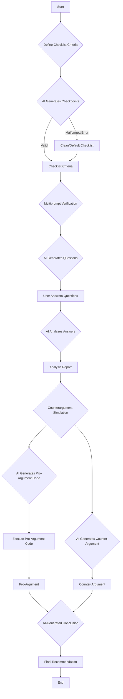

# AI-Powered Project Checklist and Assessment System

## Overview
This project provides an AI-driven system to help define, verify, and assess project readiness through a structured checklist approach. It uses AI models (Ollama and Google's Gemini) to generate checklist criteria, validate them interactively, simulate a debate between AI personas, and produce a final recommendation.

## Features
- Generate project readiness checklists tailored to your industry.
- Interactive multiprompt verification of checklist items.
- AI-simulated debate between optimistic and critical personas.
- Final AI-generated recommendation to proceed or reconsider.
- Saves detailed assessment results to `project_assessment_output.json`.
- Supports loading predefined input from `project_assessment_input.json` for automated assessments.

## Requirements
- Python 3.x
- `requests` library
- `google.generativeai` Python client
- Environment variable `GEMINI_API_KEY` set with your Gemini API key.
- Optional: Ollama server running locally at `http://localhost:11434` for enhanced performance.

## Usage
1. Set the `GEMINI_API_KEY` environment variable.
2. (Optional) Start the Ollama server locally.
3. Run the script:
   ```bash
   python main.py
   ```
4. Follow the interactive prompts to enter your project industry and answer validation questions.
5. Review the AI-generated analysis, debate, and final recommendation.
6. Check `project_assessment_output.json` for full output data.

## Logging
The script uses Python's logging module to provide runtime information and error messages.

## License
This project is provided as-is for prototyping and educational purposes.

## Project Diagram


